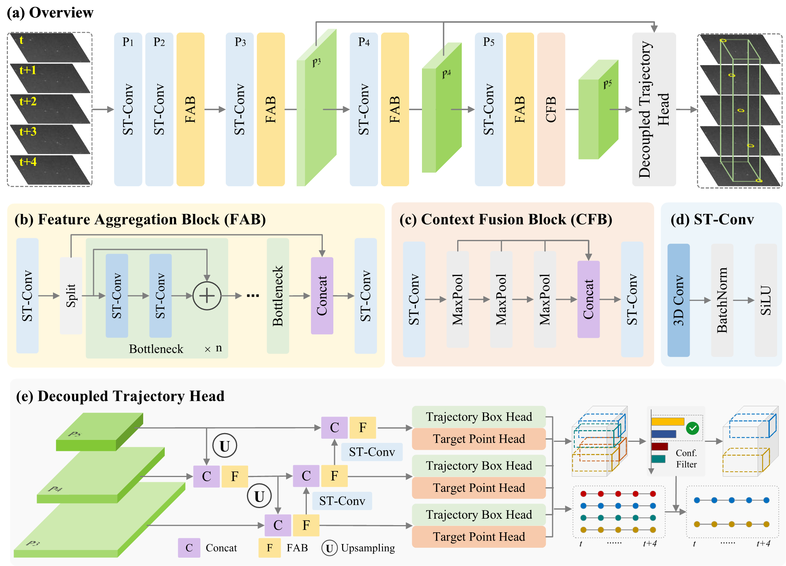

# MCDet: A Motion-Centric Spatiotemporal Framework for Dim Moving Object Detection

MCDet targets dim moving object detection under low-visibility conditions. The framework emphasizes motion-centric modeling and spatiotemporal feature learning, combining temporal aggregation with 3D trajectory-aware detection heads. It is designed to provide robust localization and keypoint estimation when appearance cues are weak or inconsistent.

## Framework Overview


## Installation
### Requirements
- Python 3.9+
- PyTorch and torchvision (install builds that match your CUDA runtime if using GPU)
- CUDA (optional, required for GPU training)

### Setup
```bash
python -m venv .venv
source .venv/bin/activate
pip install -U pip
pip install -r requirements.txt
```

## Dataset Preparation
The AstroDim dataset is publicly available on [Hugging Face](https://huggingface.co/datasets/CastleChen339/AstroDim). MCDet expects the dataset to be organized as multiple scene folders, each containing paired PNG frames and JSON annotations. Each frame has a one-to-one PNG/JSON match based on sorted filenames.

### Expected layout
```
AstroDim/
├── train/
│   ├── scene_001/
│   │   ├── images/
│   │   │   ├── 000000.png
│   │   │   └── ...
│   │   └── json/
│   │       ├── 000000.json
│   │       └── ...
│   └── ...
└── val/
    ├── scene_101/
    │   ├── images/
    │   └── json/
    └── ...
```

### Annotation format
Each JSON file should contain:
- `imageWidth` and `imageHeight`
- `shapes`: a list of objects with fields `label`, `group_id`, and `points` (single 2D point per frame)

Label names are mapped in `datasets/AstroDim_dataset.py` via `LABEL_DICT`. Update this mapping if you introduce new labels.

### Paths and symlinks
Update the dataset paths in `config.py` (`DatasetConfig.train_root` and `DatasetConfig.val_root`). You may also use symbolic links to point those paths to your storage location.

## Training
The main training entrypoint is `train.py`.

```bash
python train.py --save-dir ./checkpoints
```

Resume training from the latest checkpoint:

```bash
python train.py --save-dir ./checkpoints --resume
```

Checkpoints are saved to the `save-dir` as `last.pt` and `best.pt`.

## Evaluation
The evaluation entrypoint is `test.py`.

```bash
python test.py --weights ./checkpoints/best.pt --data-root /path/to/AstroDim/val
```

Use optional flags to override sequence length, batch size, and thresholds:

```bash
python test.py --weights ./checkpoints/best.pt --data-root /path/to/AstroDim/val \
  --seq-len 5 --batch-size 2 --conf 0.25 --iou 0.30 --point-conf 0.50
```

## Citation
If you find this work useful, please cite:

```bibtex
@article{chen2026mcdet,
  title = {MCDet: A motion-centric spatiotemporal framework for dim moving object detection},
  journal = {Pattern Recognition},
  pages = {114977},
  year = {2026},
  issn = {0031-3203},
  doi = {10.1016/j.patcog.2026.114977},
  url = {https://www.sciencedirect.com/science/article/pii/S0031320326019412},
  author = {Jiuchen Chen and Qizhi Xu and Kaiqi Li and Xinyu Yan and Xiaolin Han}
}
```
